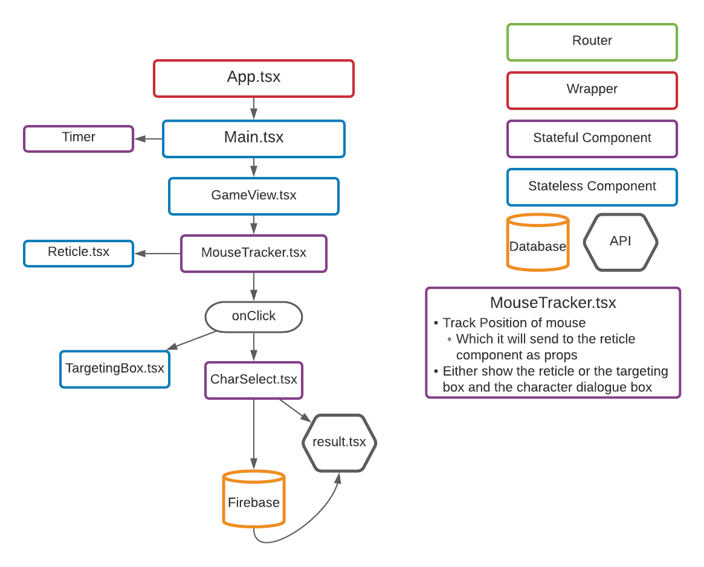

# Where's Waldo (Emerson) App

## How To Play:
- You are looking for 2 philosophers and a poet in a modern cityscape: 
  - Ralph Waldo Emerson
  - Henry David Thoreau
  - Walt Whitman 
  
- Navigate with the mouse wheel, arrow keys or scrollbars
- Click somewhere on the image to pull up the character selection menu, then select which character you think you have found.
- Find all 3 then submit your high score to see how you stack up!
- If you need any help hover over the ```?``` Tool tip in the bottom right corner of the screen

### Functionality:
- Query Firebase/ Firestore API to get coordinates of each character position, then cross-reference them to the coordinates ```onClick``` of the mouse position (Works on all screens!) 
- Update Firestore data in near realtime, showing a user a list of the top 100 scores
- Custom-made, one of a kind, photoshopped image - courtesy of myself.

### Things I learned:
- Using a database snapshot for App logic as opposed to re-querying the database multiple times throughout the application lifecycle.
- ```useRef()``` Hook to access native ```DOM``` nodes in React.
- The benefit of strict Typing in TypeScript
- The modularization of having your components styled component file in the same directory as the component to keep them 'coupled' together so their 'concerns' are clearly seperated from other components.


## Project Architecture Plan:

### A Note:
The purpose of this Entity Relationship Diagram was to be more thorough in the planning stage of this project, to improve my coding efficiency and structure.
<br/>

Some component names were changed, such as "reticle" which was added into the ```Targetbox.tsx``` component.
Also, "API" refers to the firestore API (```getDoc, setDoc```)


