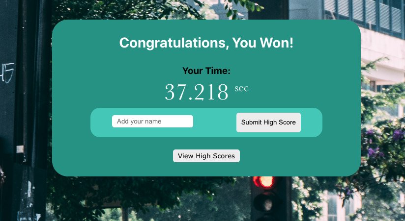

<div align="center">

## Where's Waldo (Emerson) App


</div>

### Table Of Contents:
1. [Live Deployment](#link-to-deployment)
2. [Getting Started](#getting-started)
3. [Description](#description)
4. [Pictures](#pictures)
5. [Functionality](#functionality)
6. [Technologies Used](#technologies-used)
7. [Things I Learned](#things-i-learned)
8. [License](#license)
9. [Acknowledgements](#acknowledgements)

### Link To Deployment
🖥 &nbsp; Live demo: [Where's Waldo (Emerson)](https://whereswaldo-d9d9f.web.app/)

<sup>[Back to top](#table-of-contents)</sup>

## Getting Started

1. ⬇️ Clone the repository to your local machine
   ```shell
   git clone git@github.com:EpictetusZ1/wheres-waldo.git
   ```
2. Install project dependencies with npm
   ```shell
   npm install
   ```
3. 🏃‍ Run project
   ```shell
   npm run start
   ```

<sup>[Back to top](#table-of-contents)</sup>

## Description
An assignment from [The Odin Project](https://www.theodinproject.com/)

Based on the popular children's game "Where's Waldo" this modern reimagination has you placed in the bustling streets of some unnamed city.

The goal: Find 2 philosophers and a poet... the poet is there for variety and not because the author couldn't find good pictures of another transcendentalist philosopher to go with the theme.

The timer starts as soon as the page loads (First Contentful Paint).

### How To Play:

- You are looking for 2 philosophers and a poet in a modern cityscape:
  - Ralph Waldo Emerson
  - Henry David Thoreau
  - Walt Whitman

- Navigate with the mouse wheel, arrow keys or scrollbars
- Click somewhere on the image to pull up the character selection menu, then select which character you think you have found.
- Find all 3 then submit your high score to see how you stack up!
- If you need any help hover over the ```?``` tool tip in the bottom right corner of the screen

### Planning Phase:


The purpose of this Entity Relationship Diagram was to be more thorough in the planning stage of this project, to improve my coding efficiency and structure.

<sup>[Back to top](#table-of-contents)</sup>

## Pictures

Character Selection


Submit high score modal



Game area


<sup>[Back to top](#table-of-contents)</sup>

## Functionality

- Query Firebase / Firestore API to get coordinates of each character position, then cross-reference them to the coordinates from ```onClick``` of the mouse position (Works on all screens!)
- Update Firestore data in near realtime, showing a user the "Top 100 Scores" list.
- Features a custom-made, one of a kind, photoshopped image - courtesy of myself.

<sup>[Back to top](#table-of-contents)</sup>

## Technologies Used

- React
- TypeScript
- Firebase
  - Firestore
  - Google Authenticator
- Styled Components

<sup>[Back to top](#table-of-contents)</sup>

## Things I Learned

- Using a database 'snapshot' for App logic as opposed to re-querying the database multiple times throughout the applications' lifecycle.
- ```useRef()``` Hook to access native ```DOM``` nodes in React.
- The benefit of strict typing in TypeScript and React
- The modularization of having your components styled component file in the same directory as the component to keep them 'coupled' together so their 'concerns' are clearly seperated from other components.

<sup>[Back to top](#table-of-contents)</sup>

## License
Distributed under the MIT License. See `LICENSE.txt` for more information.

<sup>[Back to top](#table-of-contents)</sup>

## Acknowledgements
No attribution required, project was authored by Jack Heaton - ([EpictetusZ1](https://github.com/EpictetusZ1)).

<sup>[Back to top](#table-of-contents)</sup>
